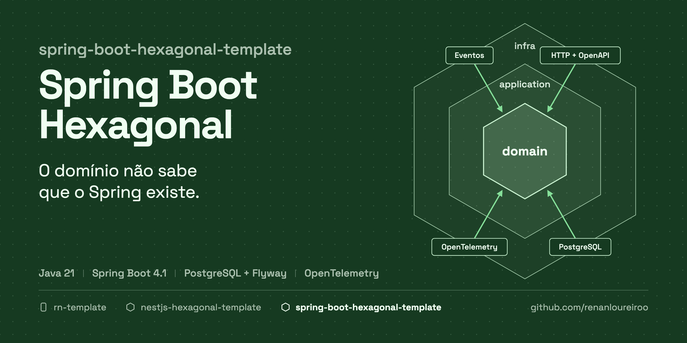
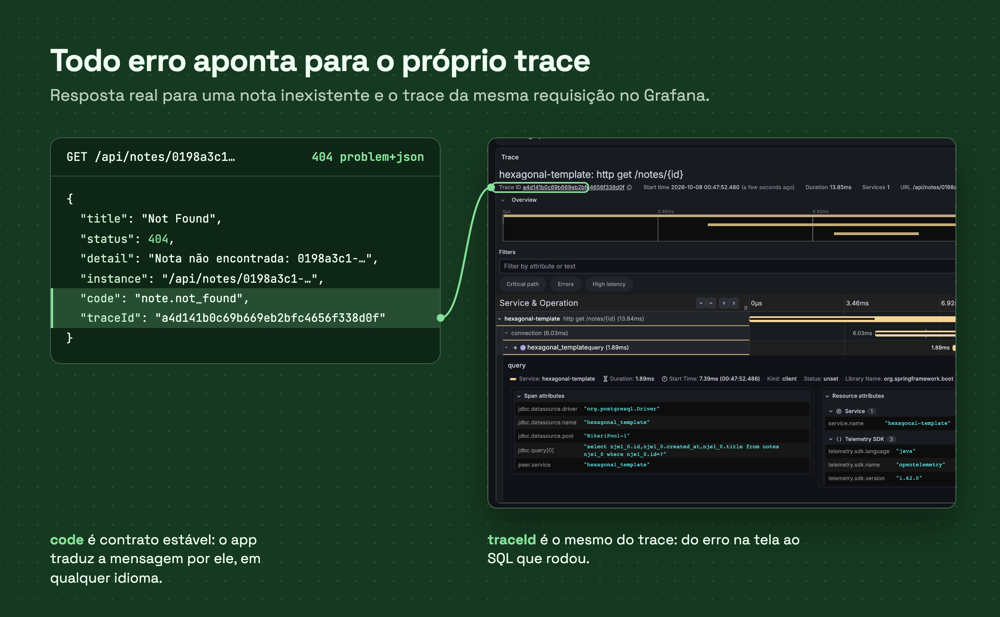
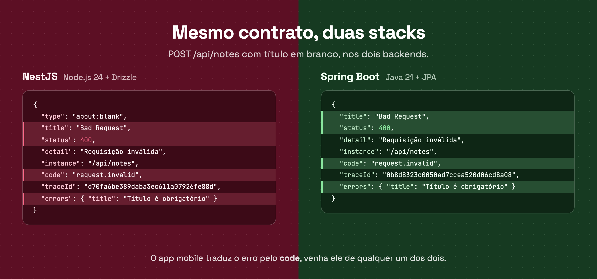

# Spring Boot Hexagonal Template

<!-- template:start -->



[](https://github.com/renanloureiroo/spring-boot-hexagonal-template/actions/workflows/ci.yml)


**Um backend Spring Boot em que o domínio é Java puro: casos de uso sem anotação de framework,
erros com contrato estável, banco de verdade nos testes e telemetria desde o primeiro request.**

O caminho comum em Spring é a regra de negócio morar num `@Service`, a entidade JPA atravessar o
sistema até o JSON e os testes subirem o contexto inteiro com `@MockitoBean`. Funciona até a
primeira mudança de banco, de protocolo ou de time. Este template começa do outro jeito: o núcleo
não conhece Spring, JPA nem HTTP, e o framework fica na borda, onde é fácil trocar.

[**→ Use this template**](https://github.com/renanloureiroo/spring-boot-hexagonal-template/generate)

## Por que usar

- **Núcleo sem framework.** `core`, `domain` e `application` são Java puro: nada de
  `org.springframework.*`, `jakarta.persistence.*`, `jakarta.validation.*` ou tipos HTTP.
- **Casos de uso de verdade.** POJOs sem `@Service`, um método `execute`, `Input` e `Output` como
  `record` aninhados. O cabeamento é um `@Bean` explícito por caso de uso.
- **Domínio sempre válido.** Entidades com `create` e `restore`, ids tipados e value objects em
  `record` que validam as invariantes no construtor. Caso de uso não repete validação.
- **Entidade de domínio separada da entidade JPA.** Mappers explícitos nos dois sentidos; o modelo
  evolui sem carregar anotação de persistência.
- **Transações e eventos sob controle.** A intenção transacional é uma abstração do núcleo,
  implementada com Spring na infraestrutura. Eventos de domínio são publicados depois do commit.
- **Erros como contrato público.** Toda falha sai em RFC 9457 (`application/problem+json`) com
  `code` estável e `traceId`. A conversão de `ErrorType` para status HTTP mora num único lugar.
- **Testes que confiam no banco real.** Fakes para as portas (mocks sobre portas do projeto são
  proibidos), JUnit e AssertJ nos testes de unidade e E2E com Testcontainers e PostgreSQL.
- **Observabilidade de série.** OpenTelemetry com logs, métricas e traces. Ao subir a aplicação,
  o Docker Compose traz PostgreSQL e Grafana LGTM junto.
- **OpenAPI completo.** springdoc com Swagger UI e todos os status possíveis documentados.
- **Migrations versionadas.** Flyway com prefixo de timestamp UTC e `ddl-auto=validate` para pegar
  divergência entre entidade e schema.
- **Pronto para agentes de código.** `AGENTS.md`, documentação prescritiva, ADRs e as skills do
  [Spec Kit](https://github.com/github/spec-kit) dão a qualquer agente as mesmas regras que o time
  segue.

## Veja funcionando



Uma busca por nota inexistente devolve RFC 9457 com `code` estável e `traceId`. O mesmo id
abre o trace da requisição no Grafana que sobe junto com a aplicação.

## O que vem pronto

| Área            | Escolha                                                         |
| --------------- | --------------------------------------------------------------- |
| Runtime         | Java 21 e Maven Wrapper                                         |
| Framework       | Spring Boot 4.1 com Web MVC, Validation, Data JPA e Actuator    |
| Persistência    | PostgreSQL e Flyway                                             |
| API             | OpenAPI com springdoc e Swagger UI                              |
| Observabilidade | OpenTelemetry (inclusive logs) e Grafana LGTM no Docker Compose |
| Testes          | JUnit Jupiter, AssertJ e Testcontainers                         |
| Qualidade       | CI no GitHub Actions com `./mvnw verify`                        |
| Entrega         | Dockerfile e health check pelo Actuator                         |
| Documentação    | arquitetura, estratégia de testes, ADRs e `AGENTS.md`           |

## Arquitetura em 30 segundos

```text
infra  ─────►  application  ─────►  domain
  │                                      ▲
  └────────────────►  core  ◄────────────┘
```

```text
requisição ─► DTO + Bean Validation ─► controller ─► caso de uso ─► domínio
                                                          │
                                                          ▼
                                     porta ─► adaptador JPA ─► PostgreSQL
                                                          │
resposta HTTP ◄─ presenter ◄─ output ◄────────────────────┘
```

Cada contexto de negócio é um módulo em `modules/<contexto>`, com `domain`, `application` e
`infra` próprios. Módulos não importam o domínio uns dos outros: quando um precisa de outro,
declara uma porta. O passo a passo está em [docs/ARCHITECTURE.md](docs/ARCHITECTURE.md).

## Uma família de templates

| Template                                                                                 | Stack                       | Papel      |
| ---------------------------------------------------------------------------------------- | --------------------------- | ---------- |
| **spring-boot-hexagonal-template** (este)                                                | Java 21, Spring Boot, JPA   | API        |
| [nestjs-hexagonal-template](https://github.com/renanloureiroo/nestjs-hexagonal-template) | Node.js 24, NestJS, Drizzle | API        |
| [rn-template](https://github.com/renanloureiroo/rn-template)                             | Expo, React Native          | app mobile |



Os dois backends têm a mesma arquitetura, os mesmos contratos HTTP, os mesmos códigos de erro e
os mesmos tipos de teste. O time escolhe a linguagem que domina sem abrir mão do desenho, e o app
mobile lê os erros de qualquer um dos dois sem adaptação.

## Comece em um minuto

1. Clique em
   [**Use this template**](https://github.com/renanloureiroo/spring-boot-hexagonal-template/generate)
   e dê ao repositório o nome do serviço, por exemplo `orders-service`.
2. Espere o workflow `template-init` (cerca de 30 s): ele renomeia pacote, classe principal,
   artefato, banco e título da API a partir do nome do repositório.
3. Clone e rode:

   ```bash
   cp src/main/resources/application-local.yml.example \
     src/main/resources/application-local.yml
   ./mvnw spring-boot:run
   ```

Em seguida, abra o Swagger em `http://localhost:8080/api/swagger-ui.html` e o Grafana em
`http://localhost:3000`. Os detalhes estão em [Usando como template](#usando-como-template).

---

<!-- template:end -->

Backend Java 21 com Spring Boot, arquitetura modular, PostgreSQL, Flyway, OpenTelemetry e
Testcontainers.

O módulo `example` implementa uma API pequena de notas para mostrar o caminho
completo: domínio → caso de uso → porta → JPA → HTTP. Ele deve ser removido ou
renomeado quando o primeiro contexto real for criado.

## Requisitos

- Java 21;
- Docker;
- Docker Compose.

## Rodando localmente

Crie a configuração local a partir do exemplo:

```bash
cp src/main/resources/application-local.yml.example \
  src/main/resources/application-local.yml
./mvnw spring-boot:run
```

O profile `local` é ativado pelo plugin Maven. A aplicação fica disponível em:

- API: `http://localhost:8080/api`;
- Swagger UI: `http://localhost:8080/api/swagger-ui.html`;
- Health: `http://localhost:8080/api/actuator/health`;
- Grafana: `http://localhost:3000`.

Exemplo:

```bash
curl -i -X POST http://localhost:8080/api/notes \
  -H 'Content-Type: application/json' \
  -d '{"title":"Minha primeira nota"}'

curl -i 'http://localhost:8080/api/notes?page=0&size=20'
```

## Testes

```bash
./mvnw test
./mvnw verify
./mvnw test -DexcludedGroups=e2e
./mvnw test -Dgroups=e2e
```

Os testes E2E exigem Docker. Veja [docs/TESTS.md](docs/TESTS.md).

## Imagem da aplicação

```bash
docker build -t spring-boot-hexagonal-template .
```

<!-- template:start -->

## Usando como template

Clique em **Use this template** e dê ao repositório o nome do projeto, por exemplo
`orders-service`. No primeiro push, o workflow `template-init` renomeia tudo a
partir desse nome e commita o resultado:

| Item                      | Exemplo para `orders-service` |
| ------------------------- | ----------------------------- |
| Pacote                    | `com.<owner>.ordersservice`   |
| Classe principal          | `OrdersServiceApplication`    |
| `artifactId` e imagem     | `orders-service`              |
| `spring.application.name` | `orders-service`              |
| Banco e usuário locais    | `orders_service`              |
| Título da API             | `Orders Service API`          |

Aguarde o workflow terminar (aba **Actions**, cerca de 30 s) antes de clonar.

Para inicializar localmente, depois de clonar:

```bash
scripts/init-template.sh orders-service com.acme
```

Depois da inicialização:

1. ajuste `description` no `pom.xml`;
2. remova ou renomeie `modules/example` e sua migration;
3. substitua este README pela apresentação do produto;
4. revise as decisões abertas em `docs/ARCHITECTURE.md` e registre as que forem tomadas em
   `docs/adr`.

<!-- template:end -->

## Documentação

- [Arquitetura](docs/ARCHITECTURE.md)
- [Testes](docs/TESTS.md)
- [Decisões de arquitetura (ADRs)](docs/adr/README.md)
